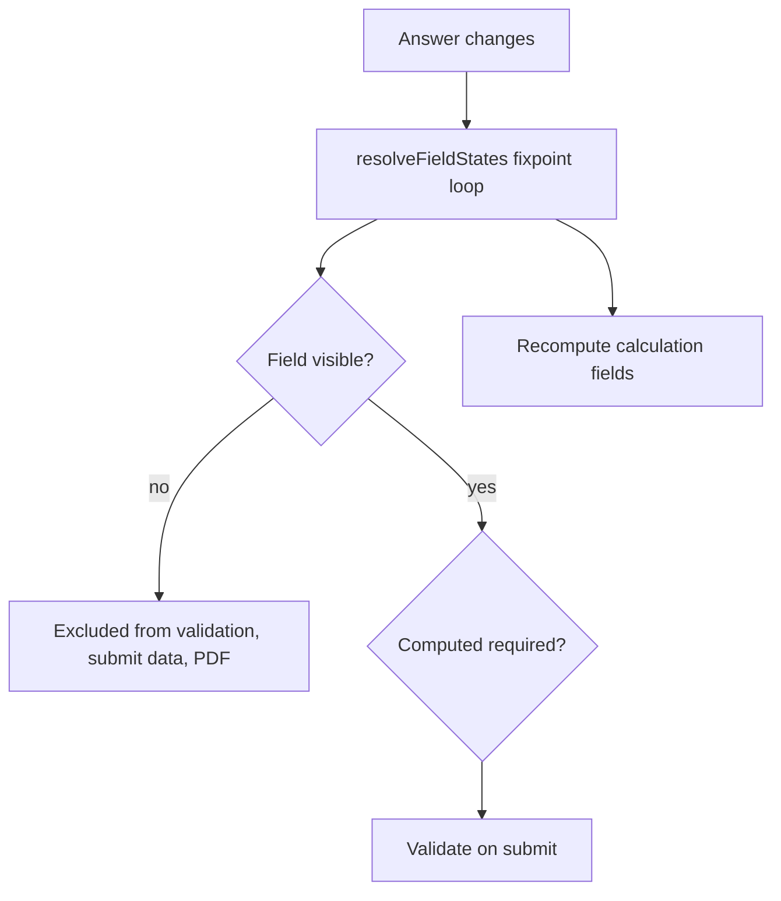

# Form Builder — Implementation & Design Document

A browser-based form builder (Builder Mode + Fill Mode) with conditional logic,
calculations, and native PDF export. All data persists to `localStorage`. No backend.

This document describes the architecture, data model, and the key design decisions
**before** implementation, so the build is mechanical to follow and easy to review.

---

## 1. Tech Stack

| Concern | Choice | Reasoning |
| --- | --- | --- |
| Framework | Next.js 16 (App Router) + React 19 + TypeScript | App Router gives real, refresh-safe URLs; strong typing is a grading criterion. The app is fully client-side (localStorage only). |
| Styling | Tailwind CSS v4 (`@tailwindcss/postcss`) | Fast, consistent SaaS-quality UI without a heavy component library. |
| State | Zustand + `persist` middleware | Minimal boilerplate, ergonomic selectors, built-in `localStorage` persistence + migrations. |
| Routing | Next.js App Router (`next/navigation`) | File-system routes for Home / Favourites / Builder / Fill / Instances; survives refresh. |
| Drag & drop | `@dnd-kit/core` + `@dnd-kit/sortable` | Accessible, keyboard-friendly DnD for palette→canvas, field reorder, option reorder. |
| PDF export | **Browser-native only** (`window.print` via a generated print document) | Required by spec — no third-party PDF libraries. |

> Package manager is **bun** (`bun.lock` present; `packageManager` pinned to `bun@1.2.10`).
> All installs use `bun add`. Scripts: `bun dev`, `bun run build`, `bun start`,
> `bun run lint` (eslint-config-next), `bun run typecheck` (`tsc --noEmit`).
>
> Because all data lives in `localStorage`, data-driven pages are wrapped in a
> `ClientOnly` boundary so they render only after hydration, avoiding server/client
> markup mismatches.

---

## 2. Folder Structure

```
app/                           # Next.js App Router (routing only; thin pages)
  layout.tsx                   # root layout (html/body, metadata)
  globals.css
  (main)/
    layout.tsx                 # shared chrome via AppLayout
    page.tsx                   # Home -> TemplatesListPage
    favourites/page.tsx        # Favourites -> TemplatesListPage favouritesOnly
    templates/[templateId]/instances/page.tsx
  builder/[templateId]/page.tsx
  fill/[templateId]/page.tsx
src/
  views/                       # page-level views rendered by the route files
    TemplatesListPage.tsx      # Home / Favourites list (search + favourite toggle)
    BuilderPage.tsx            # Builder Mode (3-panel)
    FillPage.tsx               # Fill Mode
    InstancesPage.tsx          # Filled instances for a template
  components/                  # shared UI (AppLayout, ClientOnly, Modal, ui, icons, ...)
  fields/                      # ONE folder per field type — the extension point
    contract.ts                # FieldDefinition interface + defineField() helper
    registry.ts                # FieldRegistry: maps FieldType -> FieldDefinition
    types.ts                   # discriminated-union field/value types
    value.ts                   # value helpers (emptiness, etc.)
    singleLineText/
      definition.tsx           # palette meta, ConfigPanel, Renderer, validate, toPdf, operators
    multiLineText/
    number/
    date/
    singleSelect/
    multiSelect/
    fileUpload/
    sectionHeader/
    calculation/
  builder/
    BuilderEditor.tsx          # owns the editable draft + Save/Preview
    FieldPalette.tsx           # left panel, generated from registry
    FieldCanvas.tsx            # center, sortable list
    SortableFieldRow.tsx
    DragPreview.tsx            # drag overlay
    FieldPreview.tsx
    ConfigPanel.tsx            # right panel, delegates to registry ConfigPanel
    ConditionsEditor.tsx       # shared conditional-logic editor (all field types)
  fill/
    FormRenderer.tsx           # renders a template, owns answer state
    FieldRenderer.tsx          # delegates to registry Renderer + visibility/required
    ResponseView.tsx           # read-only view of a submitted instance
    ResponsesPanel.tsx
    initialValues.ts           # builds the empty/prefilled answer map
  logic/
    conditions.ts             # condition evaluation + field-state resolver
    calculation.ts            # calculation aggregation
    validation.ts             # submit-time validation (visible fields only)
    configValidation.ts       # builder-time config validation (blocks Save)
  store/
    templates.ts              # Zustand store: templates CRUD
    instances.ts              # Zustand store: instances CRUD
  pdf/
    printInstance.ts          # build native print document + window.print()
  lib/
    id.ts, format.ts, useHasMounted.ts
```

**Extension promise (grading criterion):** adding an 11th field type = create one
folder under `fields/` and add one line to `registry.ts`. The palette, config panel,
fill renderer, validation, conditional operators, and PDF serialization all read from
the registry — no other file is edited.

---

## 3. Data Model (TypeScript)

All field types are a **discriminated union** keyed on `type`, so `switch (field.type)`
is exhaustive and the compiler enforces handling every type.

```ts
export type FieldType =
  | 'singleLineText'
  | 'multiLineText'
  | 'number'
  | 'date'
  | 'singleSelect'
  | 'multiSelect'
  | 'fileUpload'
  | 'sectionHeader'
  | 'calculation';

// Conditional logic is NOT a field type — it is a capability of every field.
export interface BaseField {
  id: string;
  type: FieldType;
  label: string;
  // Conditional logic
  defaultVisible: boolean;     // "Default visibility"
  defaultRequired: boolean;    // "Default required" === the per-field Required toggle
  conditions: Condition[];
}

export interface SingleLineTextField extends BaseField {
  type: 'singleLineText';
  config: { placeholder?: string; minLength?: number; maxLength?: number; prefix?: string; suffix?: string };
}
export interface MultiLineTextField extends BaseField {
  type: 'multiLineText';
  config: { placeholder?: string; minLength?: number; maxLength?: number; rows: number };
}
export interface NumberField extends BaseField {
  type: 'number';
  config: { min?: number; max?: number; decimals: 0|1|2|3|4; prefix?: string; suffix?: string };
}
export interface DateField extends BaseField {
  type: 'date';
  config: { prefillToday: boolean; minDate?: string; maxDate?: string };
}
export interface Option { id: string; label: string; value: string }
export interface SingleSelectField extends BaseField {
  type: 'singleSelect';
  config: { options: Option[]; display: 'radio' | 'dropdown' | 'tiles' };
}
export interface MultiSelectField extends BaseField {
  type: 'multiSelect';
  config: { options: Option[]; minSelections?: number; maxSelections?: number };
}
export interface FileUploadField extends BaseField {
  type: 'fileUpload';
  config: { allowedTypes: string[]; maxFiles?: number };
}
export interface SectionHeaderField extends BaseField {
  type: 'sectionHeader';
  config: { size: 'xs'|'sm'|'md'|'lg'|'xl' }; // maps to h2..h6 weight/level
}
export interface CalculationField extends BaseField {
  type: 'calculation';
  config: { sourceFieldIds: string[]; aggregation: 'sum'|'average'|'min'|'max'; decimals: 0|1|2|3|4 };
}

export type AnyField =
  | SingleLineTextField | MultiLineTextField | NumberField | DateField
  | SingleSelectField | MultiSelectField | FileUploadField
  | SectionHeaderField | CalculationField;
```

### Values

```ts
export interface FileMeta { name: string; size: number; type: string }

export type FieldValue =
  | string                 // text, multiline, date (ISO), singleSelect (option id)
  | number                 // number, calculation (derived, read-only)
  | string[]               // multiSelect (option ids)
  | FileMeta[]             // fileUpload (metadata only)
  | null;                  // empty
```

### Conditions

```ts
export type ConditionEffect = 'show' | 'hide' | 'require' | 'unrequire';

export type TextOperator   = 'equals' | 'notEquals' | 'contains';
export type NumberOperator = 'equals' | 'gt' | 'lt' | 'inRange';
export type SelectOperator = 'equals' | 'notEquals';
export type MultiOperator  = 'containsAny' | 'containsAll' | 'containsNone';
export type DateOperator   = 'equals' | 'before' | 'after';
export type Operator = TextOperator | NumberOperator | SelectOperator | MultiOperator | DateOperator;

export interface Condition {
  id: string;
  targetFieldId: string;     // cannot equal the owning field's id (enforced in UI)
  operator: Operator;
  value: string | number | string[] | { min: number; max: number };
  effect: ConditionEffect;
}
```

### Persistence entities

```ts
export interface FormTemplate {
  id: string;
  title: string;
  fields: AnyField[];
  favorite: boolean;   // surfaced in the Favourites view
  createdAt: string;   // ISO
  updatedAt: string;   // ISO
}

export interface FormInstance {
  id: string;
  templateId: string;
  values: Record<string /* fieldId */, FieldValue>;
  submittedAt: string; // ISO
}
```

---

## 4. localStorage Schema & Reasoning

Two top-level, **versioned** keys managed by Zustand `persist`:

```
formix:templates:v1   ->  { state: { templates: FormTemplate[] }, version: 1 }
formix:instances:v1   ->  { state: { instances: FormInstance[] }, version: 1 }
```

Reasoning:
- **Separate templates and instances.** Instances reference a template by `templateId`.
  This keeps a template document small, lets "filled instances" count be derived
  (`instances.filter(i => i.templateId === t.id).length`), and avoids rewriting all
  instances when a template is edited.
- **Versioned keys + `version` field.** Enables `persist` `migrate()` for schema
  evolution after refresh without data loss.
- **Arrays, not maps.** Small datasets; arrays keep order deterministic and are trivial
  to serialize. Lookups are O(n) but n is tiny for a local app.
- **Files as metadata only.** `FileMeta` stores name/size/type. File bytes are never
  stored (localStorage is small and the spec forbids server upload). PDF notes that
  contents are not embedded.

---

## 5. Field Registry (the core abstraction)

```ts
// Defined in fields/contract.ts; authored via the defineField() helper.
export interface FieldDefinition<F extends AnyField = AnyField> {
  type: F['type'];
  paletteLabel: string;
  paletteDescription: string;
  icon: ReactNode;
  isInput: boolean;                              // false for sectionHeader
  createDefault: (id: string) => F;              // factory for a new field
  ConfigPanel: ComponentType<FieldConfigPanelProps<F>>;
  Renderer: ComponentType<FieldRendererProps<F>>;
  getEmptyValue: (field: F) => FieldValue;       // initial/empty answer
  validate: (field: F, value: FieldValue) => string | null;        // null === valid
  validateConfig?: (field: F, allFields: AnyField[]) => string[];  // builder-time config rules
  toPdf: (field: F, value: FieldValue) => string;                  // '' omits the value line
  // Conditional logic support (only for input types that can be a target):
  operators?: OperatorOption[];
  evaluate?: (op: Operator, fieldValue: FieldValue, conditionValue: Condition['value']) => boolean;
}

export const fieldRegistry: Record<FieldType, FieldDefinition> = { /* one entry per folder */ };
export const fieldList: FieldDefinition[] = Object.values(fieldRegistry); // drives palette
```

Every UI surface iterates the registry instead of `switch`-ing on type in many files.

---

## 6. Conditional Logic Engine — Decisions

File: `logic/conditions.ts`. Exposes:

```ts
resolveFieldStates(fields: AnyField[], values: Record<string, FieldValue>):
  Record<string, { visible: boolean; required: boolean }>
```

**Decision — multiple conditions per field (the AND/OR question):**
Conditions are evaluated **independently and applied in declaration order;
the last matching condition wins per dimension** (visibility, required).
- Rationale: a single AND/OR over the whole list cannot express "show when X, but
  also become required when Y" because conditions can have *different effects*. The
  per-condition / ordered-override model is strictly more expressive and predictable,
  and is what tools like Notion/Typeform effectively do.
- This is documented in the README as the chosen semantics.

**Decision — chained conditions & hidden targets:**
- A field's value only counts if that field is itself **visible**. When evaluating a
  condition whose target is currently hidden, the target's value is treated as empty.
- Because visibility can depend on other fields' visibility, states are resolved by
  **iterating to a fixpoint** (re-evaluate until no state changes), with a max-iteration
  cycle guard. This correctly handles chains A→B→C and converges deterministically.

**Enforced rules (from spec):**
- A field cannot target itself (UI removes the owning field from target options).
- A hidden field is never validated as required.
- A hidden field's value is excluded from submitted data and PDF.



---

## 7. Calculation Engine — Decisions

File: `logic/calculation.ts`.
- A calculation reads the **current values of its source Number fields**, applies the
  aggregation (sum / average / min / max), and rounds to `decimals`.
- **Hidden source fields are excluded** (consistent with hidden values not counting).
- Average divides by the count of sources that have a numeric value (empty ignored);
  if no sources have values, the result is empty (renders as `—`).
- A calculation field **cannot** use another calculation field as a source (UI filters
  source options to Number fields only).
- Always read-only in Fill Mode; recomputes synchronously on every answer change via a
  derived selector, so it updates in real time.

---

## 8. Validation

File: `logic/validation.ts`, run on submit.
- Iterate fields in order; **skip hidden fields entirely**.
- For visible fields: if computed `required` and value empty → error.
- Then run the registry `validate(field, value)` (length, range, decimals, min/max
  selections, file count/types). Returns a `Record<fieldId, string>` of messages.
- Submit is blocked while errors exist; errors render inline under each field.

---

## 9. Application Flows / Routes

File-system routes under `app/` (App Router); `[templateId]` is a dynamic segment.

| Route | Page |
| --- | --- |
| `/` | Templates list (Home) |
| `/favourites` | Templates list filtered to favourites |
| `/builder/[templateId]` | Builder Mode (`new` creates a fresh template) |
| `/fill/[templateId]` | Fill Mode — new instance |
| `/templates/[templateId]/instances` | Filled instances list |

- **Builder Preview** reuses `FormRenderer` inside a modal (no route change).
- **New Response** on a card routes to `/fill/[templateId]`.
- All state is in Zustand+localStorage, so every route works after a full refresh
  (data-driven views render inside a `ClientOnly` boundary after hydration).

### Builder Mode layout
- **Left:** `FieldPalette` (generated from `fieldList`) — click or drag to add.
- **Center:** `FieldCanvas` — dnd-kit sortable list; up/down buttons as accessible
  fallback; click selects a field.
- **Right:** `ConfigPanel` — common fields (label, default visibility/required) +
  the registry `ConfigPanel` + shared `ConditionsEditor`.
- Save persists template; Preview opens the modal.

---

## 10. PDF Export (native only)

File: `pdf/printInstance.ts`.
- Build a self-contained, styled **HTML document string** (form title, submission
  timestamp, then each **visible** field's label + formatted value via registry
  `toPdf`, in form order). Hidden fields are omitted entirely.
- Write it into a hidden `<iframe>` (or `window.open`), then call `print()` so the user
  saves as PDF via the browser's native print dialog. No third-party libraries.
- This works both right after submit and for **re-download** from the Instances list
  (re-resolve visibility from stored values + template).
- **File uploads:** rendered as `name (size, type)` with a note that file contents are
  not embedded in the export.

---

## 11. Documented Product Decisions (under-specified cases)

- **Required toggle == Default required**, and **Default visibility == visible** by
  default. Conditions override these.
- **Multiple conditions:** ordered, last-match-wins per dimension (Section 6).
- **Hidden values** never count for validation, calculations, conditions, submission, or PDF.
- **Single Select empty value** = no option selected; required fails if none chosen.
- **Number decimals** clamp/format on blur; `inRange` condition value is `{min,max}` inclusive.
- **Date** stored as ISO `yyyy-mm-dd`; `prefillToday` sets value on instance open only.
- **Section Header** captures no value and is skipped in validation/submit/PDF data,
  but its heading still renders in the PDF for grouping.
- **Calculation** with no usable sources renders `—` and is omitted from PDF if empty.

---

## 12. Ambiguities & Resolutions (decision log)

The spec leaves a number of cases under-specified. Per the brief ("make a decision,
document it, explain your reasoning"), each was resolved deliberately. This table is the
single place a reviewer can see every judgment call and where it is enforced in code.

| # | Ambiguity (not pinned down by the spec) | Decision | Reasoning | Enforced in |
| --- | --- | --- | --- | --- |
| 1 | How do **multiple conditions** on one field combine — AND or OR? | Independent, applied in **declaration order; last match wins per dimension** (visible / required resolved separately). | A single AND/OR can't express conditions with *different* effects ("show on X" **and** "require on Y"). Ordered-override is strictly more expressive and predictable. | `logic/conditions.ts` |
| 2 | Is **Calculation** a free-form formula or an aggregation? | **Aggregation only** (sum / average / min / max) over selected **Number** fields. No expression engine. | Matches the spec's listed options; keeps the value type a simple `number \| null` and avoids a parser/eval surface. | `fields/types.ts`, `logic/calculation.ts` |
| 3 | Can a form be **saved with a Calculation that has no sources** (the original bug report)? | **No** — save is blocked until ≥1 valid Number source is selected. | A sourceless calculation silently renders `—` forever; persisting a non-functional field is a footgun. | `fields/calculation/definition.tsx` (`validateConfig`), `logic/configValidation.ts`, `builder/BuilderEditor.tsx` |
| 4 | Should **Calculation** expose a **Required toggle and conditions** (the spec lists neither for it)? | **Yes** — treated as a normal input. A required calc that resolves to empty fails submit-time validation like any other empty required field. | A computed total can legitimately be mandatory and conditionally shown; removing the capability would be a surprising limitation. | `builder/ConfigPanel.tsx` (`isInput`), `logic/validation.ts` |
| 5 | Does a **hidden Number source** contribute to a calculation? | **Excluded.** | Consistent with the rule that hidden values never count for validation, submission, or PDF. | `logic/calculation.ts` |
| 6 | Should the builder **validate field config on Save**, or save anything? | **Block save** with inline errors; never persist an unusable template. | A template saved in a broken state degrades every downstream surface (fill, PDF). Surfacing problems at authoring time is cheapest. | `logic/configValidation.ts` (generic Label-required) + each field's `validateConfig` (selects need ≥1 labelled option; Multi Select `min ≤ max` and `max ≤ option count`; Number / Date / text `min ≤ max`; File Upload `maxFiles ≥ 1`) |
| 7 | What happens when **editing a template that already has responses**? | **Allowed, but warned.** A banner notes past responses may show stale/missing values. | Instances store raw values keyed by field id and are not migrated; blocking edits is too strict, silent edits are surprising. Versioning is a documented future improvement. | `builder/BuilderEditor.tsx` (instance-count banner) |
| 8 | How should **File Upload** render in the PDF (metadata-only storage)? | List `name (size, type)` plus a "contents are not embedded" note. | Conveys what was attached without pretending file bytes exist. | `fields/fileUpload/definition.tsx` (`toPdf`), `pdf/printInstance.ts` |
| 9 | Can a condition **target a Calculation or Section Header value**? | **No** — neither is a valid condition target. | Section Header captures no value; Calculation is derived (the operator table omits both). Targets are gated on having `operators`. | `fields/registry.ts` (`canBeConditionTarget`) |
| 10 | Are numeric **`is within range`** and date **`before` / `after`** bounds inclusive? | `inRange` is **inclusive** on both ends; `before` / `after` are **strict** (exclusive). | Matches the most common reading of "within range" vs "before/after a date". | `fields/number/definition.tsx`, `fields/date/definition.tsx` (`evaluate`) |
| 11 | Does **Number `decimals`** round the stored value or only the display? | Stored as entered; **precision is applied on display and in the PDF** (and when used as a calc source result). | Avoids lossy mutation of user input while keeping presentation consistent. | `lib/format.ts` (`round` / `formatNumber`) |
| 12 | **`prefillToday`** vs a min/max date range — what if today is out of range? | Prefill still sets **today**; submit-time validation then surfaces the range error. | Prefill is a convenience default; the user is shown the conflict rather than having it silently altered. | `fill/initialValues.ts`, `fields/date/definition.tsx` (`validate`) |
| 13 | **Multi Select `minSelections`** vs the Required toggle. | `minSelections` is enforced only once at least one option is chosen; emptiness is governed by Required. | Lets "optional, but if answered pick ≥ N" coexist with a plain required check. | `fields/multiSelect/definition.tsx` (`validate`) |
| 14 | **Empty form / empty title.** | Title falls back to "Untitled form"; a zero-field template can be saved. | Low-stakes; a half-built template is a legitimate work-in-progress to persist. | `builder/BuilderEditor.tsx` |

### Open items (intentionally not resolved yet)

- **Orphaned calculation sources.** If a source Number field is later deleted or changed
  to another type, its id is **silently skipped** at compute time, and `validateConfig`
  only complains when *zero* valid sources remain. Active pruning of dead source ids (or
  an inline "some sources are no longer valid" warning) is deferred — see Section 14.

---

## 13. Build Order (implementation phases)

1. Tooling: scaffold Next.js (App Router); add Tailwind, Zustand, dnd-kit; base layout + theme.
2. Types + registry skeleton (`fields/types.ts`, `fields/registry.ts`).
3. Stores (`templates`, `instances`) with `persist`.
4. Field definitions (all 9) — config + renderer + validate + toPdf per folder.
5. Builder Mode (palette, canvas DnD, config panel).
6. Conditional logic engine + `ConditionsEditor` UI.
7. Calculation engine + field.
8. Fill Mode + validation + submit.
9. Native PDF export.
10. Templates list + instances list.
11. README (schema, decisions, trade-offs, "what I'd improve").

---

## 14. What I'd Improve With More Time

- Undo/redo in Builder; field duplication.
- Condition builder validation (warn on cycles / contradictory effects).
- Auto-prune / warn on orphaned calculation sources when a source field is deleted or
  retyped (currently silently skipped — see Section 12 open items).
- Export/import templates as JSON; template versioning so old instances stay valid.
- Virtualized canvas for very large forms; unit tests for the logic engines.
- Richer PDF layout (logo, page breaks, multi-column) within native constraints.
